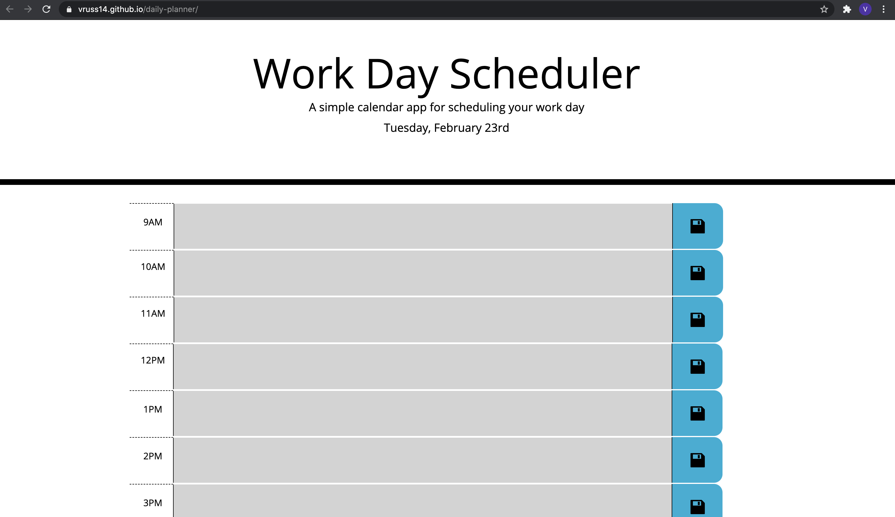

# Daily Planner

## Description

For this project, I built a simple daily planner so that a user could plan a workday. The user can save an event in a particular timeblock so that it will persist upon page refresh. Each time block is also color coded based on the time of day, with time blocks in the past appearing in gray, the current time block appearing in red, and time blocks in the future appearing in green.

Because I began with a lot of HTML and CSS starter code, one of the challenges early on was for me to determine the right CSS selectors and properties to use to build the list of time blocks. I compared the external CSS file to a picture of what the client would like the application to look like, then wrote comments for what each part of the CSS would do to achieve that goal. I ended up modifying some of the CSS by removing certain parts of it that I didn't use, and adding in extra rules to achieve the desired user experience. 

I added an SVG for a save icon, and discovered that I could modify the color of the SVG during the hover state through a CSS filter rather than swapping out the image for a different one in JavaScript. I thought this was a wonderful and lightweight solution to meet the client's preferences.

Regarding coding the JavaScript for the application, one issue I ran into was to make sure the computer could accurately differentiate between times such as 9 AM and 9 PM. I resolved this issue by choosing to use 24-hour time. Doing so made it much simpler to write conditional logic based on the current time so that each time block could be coded with the right background color. Finding a solution to store user inputs locally was fairly straightforward, and I also came up with a solution to clear local storage each day so that the planner will start out blank again once a new work day begins.

This was a fun and useful project to create, and I learned even more about for loops and local storage in the process. I also learned more about setting a new class attribute conditionally, which is a great technique to keep in mind.

Please find the deployed application here: https://vruss14.github.io/daily-planner/

## Installation

No installation steps are required to view this project. To view the front-end application, visit the URL above. The application's source code can be found on GitHub here: https://github.com/vruss14/daily-planner

## Usage

This web application is designed for all applications.

Below is a screenshot of the desktop version of the deployed application:

## Credits

HTML and CSS source code was provided by the MSU Coding Bootcamp. Valerie Russell modified the HTML and CSS as needed, and wrote the JavaScript for this application.